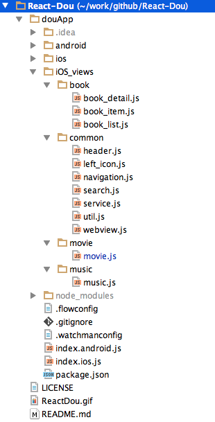
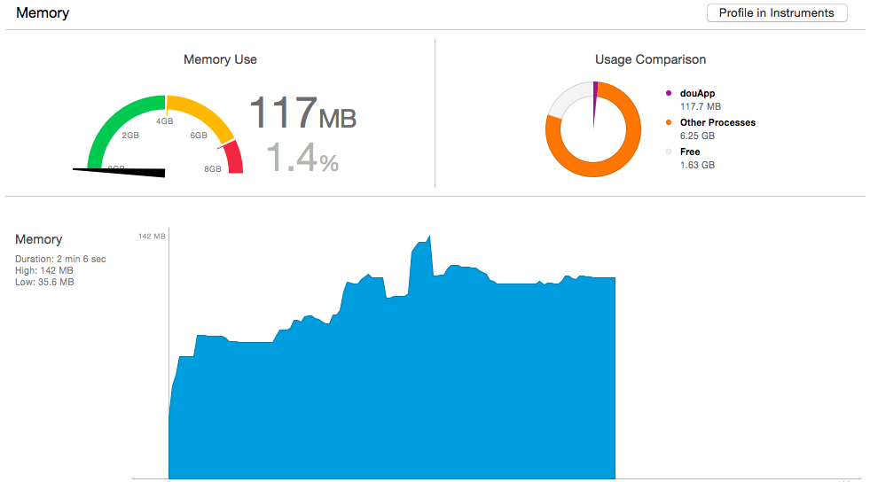
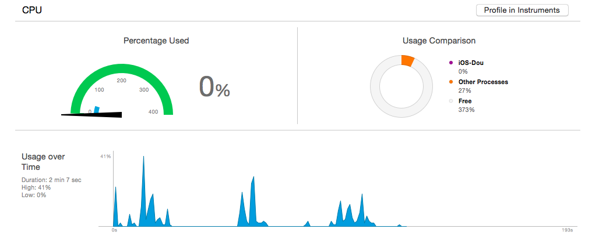
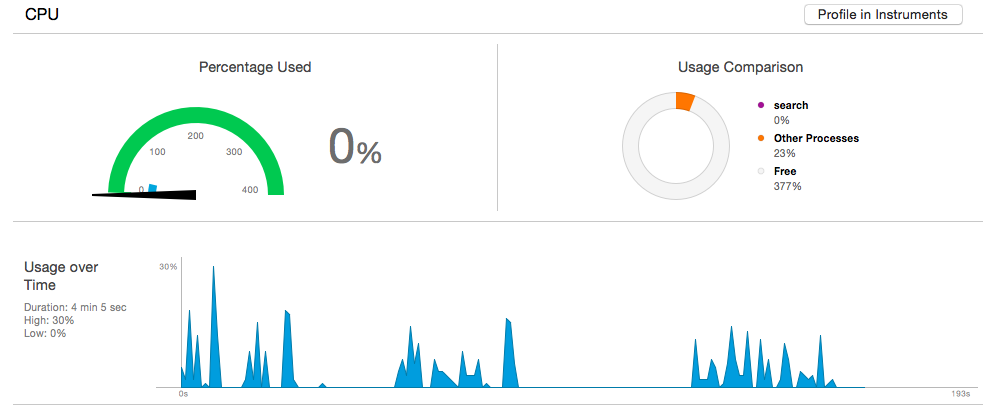

# H5、React Native、Native应用对比分析    
@王利华，vczero      
    
“存在即合理”。凡是存在的，都是合乎规律的。任何新事物的产生总要的它的道理；任何新事物的发展总是有着取代旧事物的能力。React Native来的正是时候，一则是因为H5发展到一定程度的受限；二则是移动市场的迅速崛起强调团队快速响应和迭代；三则是用户的体验被放大，用户要求极致的快感，除非你牛x（例如：12306最近修改手机号需要用户自己发短信接收验证码）。      
以下简单的介绍下H5、React Native、Native的含义：       

最近三四年间，国内外的前端与全栈开发者社区都在坚持不懈地追寻使用JavaScript与HTML、CSS技术体系开发App内场景的核心工程技术。这种技术，在国内很多公司与团队中，被通称为H5。——童遥       
 
这段是取自童老师给小二我新书作的序，没有断章取义的意思。很清楚，H5并不是狭义的HTML5新标签和API，而是工程化的“In App” technology。      

iOS/Android ——原生应用（都懂得，不解释）。             

React Native —— React & Native ，应运而生！     

##一、React Native的出现 
React Native的出现，似乎是扛起的反H5的旗子。就像当年Facebook放弃H5，全部转向Native一样。这一点，我们需要认同和保持高度的清醒。那么，React Native是否又是在吞食Native的领地呢？技术的发展，是用户风向标的导向起的作用。任何一门技术的出现，都是当时用户需求的体现。      

我们应该从以下几点看待React Native的出现。

"鉴往知来"——从过去的教训中总结经验，从用户的角度开拓未来                   
“HTML5差强人意，但是与原生应用相比还是有些差距”——为了更高的追求！ 用户体验！              
“人才宝贵，快速迭代”——Web开发者相对较多，寻找平衡点          
“跨平台！跨平台！跨平台！”——单一技术栈       
“xx是世界上最好的语言” ——工程学的范畴，没有最好，只有最适合           

HTML5 **vs** React Native **?** HTML5 **:** React Native           
结论（React Native）：       
1、原生应用的用户体验       
2、跨平台特性    
3、开发人员单一技术栈      
4、上手快，入门容易      
5、社区繁荣             

##二、3款应用效果    
**注：以下所有对比均在iOS平台下**   
          
           
            
上面3张图片，如果去掉第一张图的“HybirdApp”的字样，是否分得清哪个是React Native开发？哪个是Native应用。           
你的第一感觉是什么？           

##三、工程方案      
为了评估3种方案的技术优势和弱势。我们需要开发功能大致相似的App。这里，我们使用了“豆瓣”的API来开发“豆搜”应用。该应用能够搜索“图书”、“音乐”、“电影”。想当年，豆瓣以“图书评论”走红，尤其是12年当红！豆瓣是一个清新文艺的社区，一个“慢公司”。最近有一则网传消息，注意是网传——“传京东投1.5亿美元控股豆瓣”。今天，不聊豆瓣，我们要聊一个工程化的问题。         
  
我们需要将3款App的功能做到一致，同时需要保持技术要点一致。比如React Native这里使用了TabBar，那么Native我们也必须使用TabBar。简单而言就是：功能一致，组件 & API一致。我们功能如下图所示：            
            
       
**1、H5方案**    
在H5/Hybird应用中，我们使用AngularJS开发单页webApp，然后将该WebApp内嵌入到iOS WebView中，在iOS代码中，我们使用Navigation稍微控制下跳转。     
WebApp地址：http://vczero.github.io/search/html/index.html       
WebApp项目地址：https://github.com/vczero/search （很简单的一个项目）      
H5/Hybird项目地址：https://github.com/vczero/search_Hybird            

**2、React Native**        
在React Native中，封装必要的功能组件。      
项目地址：https://github.com/vczero/React-Dou。       
项目结构如下图：       
                                  
 
**3、Native(iOS)**           
使用React Native大致相同的组件开发App，不使用任何第三方库，代码布局。             
项目地址：https://github.com/vczero/iOS-Dou     
              
##四、对比分析          
很多时候，新技术的采用最希望看到的是数据，而不是简单说“用户体验棒，开发效率高，维护成本低”。不过，生活中也有这样的同学，知一二而能窥全貌。当然，本人生性胆小，也没有那么多的表哥和隔壁的老王，所以不敢早下定论，不敢太放肆。赵本山在《大笑江湖》中有句名言“May the force be with you”（别太放肆,没什么用）。因此，从以下几个方面做一个简单的对比。      

**－－－－－－－－－－提纲－－－－－－－－－－－－**
####1、开发方式
（1）代码结构                      
（2）UI布局              
（3）UI截面图                   
（4）路由／Navigation     
（5）第三方生态链               
####2、性能 & 体验
（1）内存         
（2）CPU        
（3）动画             
（4）安装包体积     
（5）Big ListView         
（6）真机体验             
####3、更新 & 维护
（1）更新能力         
（2）维护成本          
**－－－－－－－－－－提纲－－－－－－－－－－－－**

###1、开发方式         
很多人说React Native的代码不好看，不好理解。那是因为前端工程师都熟悉了Web的开发方式。怎么解决这个问题呢，可以先看看iOS代码，断定不熟悉iOS的同学心里会默念“一万匹**马奔腾”。那时候，你再看React Native，你会觉得使用React Native开发App是件多么美好的事！OK，我们先来看下三者在开始“一款简单App”的代码结构。      
**（1）代码结构**        
H5/Hybird的开发模式，我们需要维护3套代码，两套是Native（iOS/Android）代码，一套是WebApp版本。这里，我们使用AngularJS作为WebApp单页开发框架。如下图所示。                   
               
在React Native中，同样需要关注部分的Native代码，但是大部分还是前端熟悉的JavaScript。在“豆搜”应用中，代码结构如下：                
             
在Native开发中，更加强调Native开发者的能力。平台是：iOS/Android。           
              
结论：从前端角度而言，React Native跨平台特性，不要开发者深入的了解各平台就能开发一款高效App。同时，语言层面而言，JavaScript运用很广泛，入门门槛相对较低。React Native虽然抛弃了MVC分离实践，但是从业务角度而言，更为合理。一切而言：对前端，对移动领域是利好的消息。        

**（2）UI布局**       
“面容姣好”，合理的UI却总是跟着时间在变。那么UI布局就不是小事。        
Web开发布局目前大多是 DIV + CSS。              
React Native的布局方式是Flexbox。 
     
	   //JSX
      <ScrollView style={styles.flex_1}>
        <View style={[styles.search, styles.row]}>
          <View style={styles.flex_1}>
            <Search placeholder="请输入图书的名称" onChangeText={this._changeText}/>
          </View>
          <TouchableOpacity style={styles.btn} onPress={this._search}>
            <Text style={styles.fontFFF}>搜索</Text>
          </TouchableOpacity>
        </View>
        {
          this.state.show ?
          <ListView
            dataSource={this.state.dataSource}
            renderRow={this._renderRow}
            />
          : Util.loading
        }
      </ScrollView>
      //样式
      var styles = StyleSheet.create({
		  flex_1:{
		    flex:1,
		    marginTop:5
		  },
		  search:{
		    paddingLeft:5,
		    paddingRight:5,
		    height:45
		  },
		  btn:{
		    width:50,
		    backgroundColor:'#0091FF',
		    justifyContent:'center',
		    alignItems:'center'
		  },
		  fontFFF:{
		    color:'#fff'
		  },
		  row:{
		    flexDirection:'row'
		  }
		});        
而Native布局就有种让你想吐的感觉，尤其是iOS的布局。这里不是指采用xib或者Storyboard，而是单纯的代码，例如添加一个文本：       

	UILabel *publisher = [[UILabel alloc]init];
	publisher.frame = CGRectMake(bookImgWidth + 10, 50, 200, 30);
	publisher.textColor = [UIColor colorWithRed:0.400 green:0.400 blue:0.435 alpha:1];
	publisher.font = [UIFont fontWithName:@"Heiti TC" size:13];
	publisher.text = obj[@"publisher"];
	[item addSubview:publisher];	       
	
总结：React Native既综合了Web布局的优势，采用了FlexBox和JSX，又使用了Native原生组件。比如我们使用一个文本组件。     
`<Text style={{width:100;height:30;backgroundColor:'red'}}>测试</Text>`

**（3）UI截面图**    
**Hybrid方式截面图**         
              
可以看到第一层列表页是完整的布局，实际上这就是Web页面；而第二层灰色的是Native的WebView组件。             
**iOS UI截面图**	      
       
    
可以看到Native页面的组件特别多，即使是列表页，其中某一项都是一个组件（控件）。       

当然，我们就会想，能够完全调用原生组件呢？那样性能是否更好？       
**React Native UI截面图**    
       
         
可以清楚的看到React Native调用的全部是Native组件。并且层次更深，因为React Native做了组件的封装。如上图，蓝色边框的就是RCTScrollView组件。     

**（4）路由／Navigation**      
在Web单页面应用中，路由由History API实现。         
而React Native采用的路由是原生的UINavigationController导航控制器实现。    
React Native NavigatorIOS组件封装程度高；Navigator可定制化程度高。  
Navigator方法如下：       
  
	getCurrentRoutes() - returns the current list of routes
	jumpBack() - Jump backward without unmounting the current scene
	jumpForward() - Jump forward to the next scene in the route stack
	jumpTo(route) - Transition to an existing scene without unmounting
	push(route) - Navigate forward to a new scene, squashing any scenes that you could jumpForward to
	pop() - Transition back and unmount the current scene
	replace(route) - Replace the current scene with a new route
	replaceAtIndex(route, index) - Replace a scene as specified by an index
	replacePrevious(route) - Replace the previous scene
	immediatelyResetRouteStack(routeStack) - Reset every scene with an array of routes
	popToRoute(route) - Pop to a particular scene, as specified by its route. All scenes after it will be unmounted
	popToTop() - Pop to the first scene in the stack, unmounting every other scene         
相对Native而言，这些接口更Native还是很相似的。     

	//iOS UINavigationController  
	//相对Web而言，不用自己去实现路由，并且路由更加清晰         
	[self.navigationController pushViewController:detail animated:YES];
	
"豆搜" WebApp路由（基于AngularJS）如下：        
           
     
"豆搜" React Native版本导航如下： 	  
          

"豆搜" iOS版本导航代码如下：     
      

总结：React Native封装的导航控制更容易理解。
    
 **（5）第三方生态链**      
“我的是我的，你的也是我的。 ”——我不是“疯狂女友”，我是React Native！     
我们缺少“城市列表”组件，OK，使用JSX封装一个；觉得性能太低，OK，基于React Native方案封装一个原生组件。         
这个iOS图表库不错，拿来用呗！ => 完美！       
这一切都是基于React Native提供的模块扩展方案。    
所以说：iOS第三方库 + 部分JavaScript库 ＝ React Native 生态库     

###2、性能 & 体验         
我们都很关注一款App性能。因此测试和体验App的性能很重要。以下测试，都是基于相同的case。      
测试平台：模拟器，iphone6，iOS8.4                      
**（1）内存**      
首先，我们来看下Native应用占用的内存情况。一开始，原生应用启动后，占用内存是20~25M；针对相同的case，跑了2min，结果如下图：              
       
可以看出，峰值是87.9M，均值是72M；内存释放比较及时。      

我们再来看下Hybird App的情况。App已启动，占用内存35~55M;同样，跑了2min以上，结果如下图：    
      
可以看出，峰值在137.9M，因为整个应用在WebView中，内存释放不明显，存在缓存。       

最后，看下React Native的情况。App启动占用内存35～60M，同样跑2min以上，结果如下图：          
        
可以看出，峰值在142M，内存相对释放明显。        

总结：React Native和Web View在简单App上相差不大。二者主要：内存消耗主要是在网页数据上。

**（2）CPU**       
我们可以看一下Native应用程序CPU的情况，最高值在41%。             
      
Hybird App的最高值在30%。      
       
React Native的最高值在34%。        
         
 
 总结：CPU使用率大体相近，React Native的占用率低于Native。     
 
**（3）动画**         
React Native提供了Animated API实现动画。简单效果，基本OK。个人觉得React Native不适合做游戏，尤其布局能力。     
Native Animation提供UIView动画   
H5/Hybird：采用js动画能力     
总结：React Native Animated API / 封装Native动画库 可以满足基本需求     
    
**（4）安装包体积**   
**Hybird App:**      
34(App壳) + 5(HTML) + 125(Angular) + 29(An-route) + 6(min.js) + 4(min.css)  = 203 KB。 

**React Native:**    
不含bundle: 843KB    
含bundle: 995KB     

**Native**    
83KB        

**React Native框架包大小**      
843(不含bundle) - 32(Hybird_app空壳，初识项目) = 811KB    

相比快速迭代和热更新，比Native多了811KB一点都不重要，我们将图片素材、静态资源线上更新缓存起来即可减少很多体积。   
总结：牺牲一点体积，换更大的灵活性！（世界上哪有那么美的事，除非丑，就会想得美，:) ）。    

**（5）Big ListView & Scroll 性能**      
循环列表项500次: 
H5页面惨不忍睹      
React Native还可以接受   
Native 采用UITabView更高效，因为不渲染视图外部分。      
    
**（6）真机体验**     
机型：iphone4s，iOS7           
Native > React Native > Hybird        
如果非要给个数字的话，那我个人主观感受是：      
Native：      95％＋ 流畅度     
React Native: 85~90% 流畅度    
H5/Hybird：   70%  流畅度         

总结：Native／React Native的体验相对而言更流畅。   

###3、更新 & 维护
**（1）更新能力**   
H5/Hybird： 随时更新，适合做营销页面，目前携程一些BU全部都是H5页面；但是重要的部分还是Native。        
React Native：React Native部分可以热更新，bug及时修复。            
Native：随版本更新，尤其iOS审核严格，需要测试过关，否则影响用户。    
         
**（2）维护成本**     
H5/Hybird： Web代码 ＋ iOS/Android平台支持     
React Native：可以一个开发团队 ＋ iOS/Android工程师；业务组件颗粒度小，不用把握全局即可修改业务代码。            
Native：iOS/Android开发周期长，两个开发团队。     

总结：React Native 统一了开发人员技术栈，代码维护相对容易。     

##五、综合     
####1、开发方式
（1）代码结构： React Native更为合理，组件化程度高                   
（2）UI布局：Web布局灵活度 > React Native > Native                    
（3）UI截面图：React Native使用的是原生组件，                   
（4）路由／Navigation：React Native & Native更胜一筹         
（5）第三方生态链：Native modules + js modules = React Native modules                    
####2、性能 & 体验
（1）内存：Native最少；因为React Native含有框架，所以相对较高，但是后期平稳后会优于Native。            
（2）CPU：React Native居中。            
（3）动画：React Native动画需求基本满足。             
（4）安装包体积：React Native框架打包后，811KB。相比热更新，可以忽略和考虑资源规划。        
（5）Big ListView         
（6）真机体验：Native >= React Native > H5/Hybrid                
####3、更新 & 维护
（1）更新能力: H5/Hybird > React Native > Native            
（2）维护成本: H5/Hybird <= React Native < Native      

React Native定制难度相比Native有些大；但是具备跨平台能力和热更新能力。             
最后**硬广**一下我的书：      
          

 
