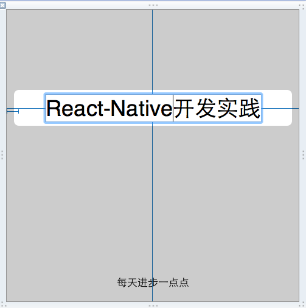
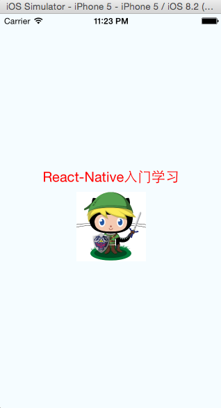
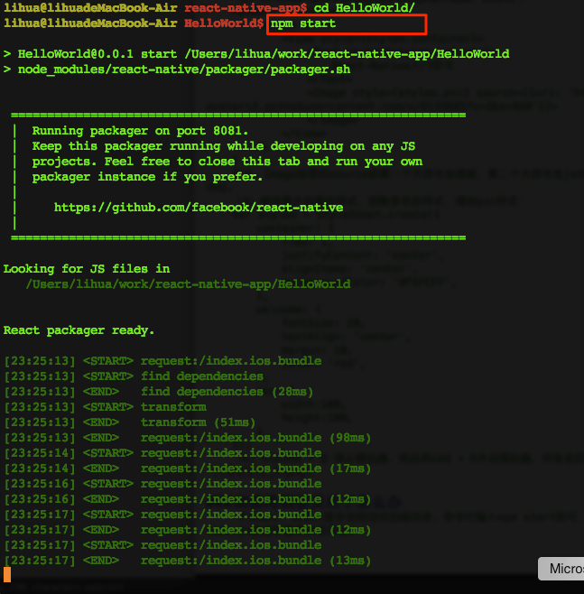

#React-Native入门指南
##第2篇代码结构
###一、了解index.ios.js
	大家都清楚，React-Native就是在开发效率和用户体验间做的一种权衡。React-native是使用JS开发，开发效率高、发布能力强，不仅拥有hybrid的开发效率，同时拥有native app相媲美的用户体验。目前天猫也在这块开始试水。
	用编辑器打开index.ios.js文件，分析代码结构：
	1、第一句：var React = require('react-native');有Node.js开发经验的同学都清楚，require可以引入其他模块。如果没有node.js开发经验的同学，可以脑补下java的import和c++的#include。
	2、第二句代码，批量定义组件：
	var {
		AppRegistry,
		StyleSheet,
		Text,
		View,
	} = React;
	其实，这只是一个语法糖而已，比如AppRegistry我们可以这样定义：var AppRegistry = React.AppRegistry;
	3、构建Heollo World入口类。React提供了React.createClass的方法创建一个类。里面的render方法就是渲染视图用的。return返回的是视图的模板代码。其实这是JSX的模板语法，可以提前学习下。
	4、相对于web开发，我们需要提供视图的样式，那么StyleSheet.create就是干这件事的，只是用JS的自面量表达了css样式。
	5、如何引入css样式？其实在render方法返回的视图模板里已经体现出来了，即style={styles.container}.其中style是视图的一个属性，styles是我们定义的样式表，container是样式表中的一个样式。
	6、注册应用入口，这个一定不能少，否则模拟器会提示报错：
		AppRegistry.registerComponent('HelloWorld', () => HelloWorld);
	
	
###二、其实你还需要看点这方面的知识
	对于React-Native开发，仅仅有基础前端开发的知识是不够的，你还需要了解和掌握的有：
* Node.js基础
* JSX语法基础
* Flexbox布局

###三、目前需要关注的文件
	1、目前阶段有几个文件时需要注意下的：
	（1）在xcode项目代码中AppDelegate.m会标识入口文件，例如：
	jsCodeLocation = [NSURL URLWithString:@"http://localhost:8081/index.ios.bundle"];
	如果是网上下载别人的源码，注意此处的ip和端口是否有被修改。
	（2）闪屏界面在哪修改？在xcode项目中找到LaunchScreen.xib文件，点击，你会看到界面，这个就是启动界面，你手动添加组件或者修改文本即可，最好了解下xcode的使用。
	（3）文本编辑器打开index.ios.js文件，是js代码的入口文件，所有的代码编写从这开始，可以定义自己的模块和引入第三方模块。

###四、修改文件index.ios.js
	1、修改启动界面，如下图

	2、添加图片和修改样式.我们在第一篇的demo基础上修改。去掉第二个和第三个<Text>,增加我们需要的图片，因为图片更具表达力，就像最近的图片社交应用很火一样。
	(1)添加Image组件，将代码修改成如下即可：
	var {
		StyleSheet,
		Text,
		View,
		Image,
	} = React;
	（2）将render返回中的模版增加Image组件视图，具体如下：
	render: function() {
    	return (
      		<View style={styles.container}>
        		<Text style={styles.welcome}>
          			React-Native入门学习
        		</Text>
        		<Image style={styles.pic} source={{uri: 'https://avatars3.githubusercontent.com/u/6133685?v=3&s=460'}}>
       			</Image>
      		</View>
    	);
    }
    其中，Image标签的source的第一个大括号是模板，第二个大括号是js对象，js对象里面有个key是uri,表示图片的地址。
    （3）修改图片视图的样式，删除多余的样式，增加pic样式：
    var styles = StyleSheet.create({
    	container: {
    		flex: 1,
    		justifyContent: 'center',
    		alignItems: 'center',
    		backgroundColor: '#F5FCFF',
    	},
    	welcome: {
    		fontSize: 20,
    		textAlign: 'center',
    		margin: 10,
    		color: 'red',
    	},
    	pic: {
    		width:100,
    		height:100,
    	}
    });
    （4）可以cmd + Q 停止模拟器，然后再cmd + R开启模拟器，你会发现启动界面和首页都你想要的样子：
 
 
###如果终端被关闭了怎么办
	 不用担心，其实只要你切到项目的根目录，命令行输入npm start即可，这样即可开发终端监听。实际上也是node.js的监听服务开启而已。如下图表示成功。
 	
	
	
	